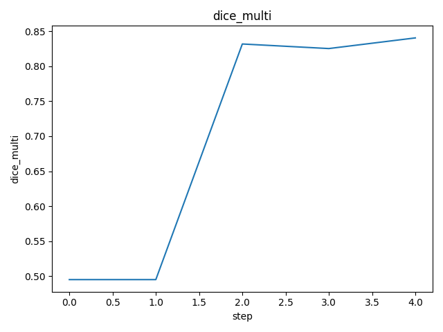
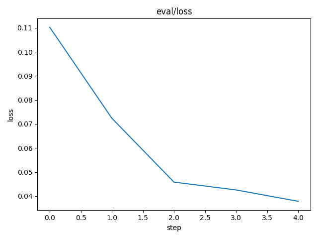
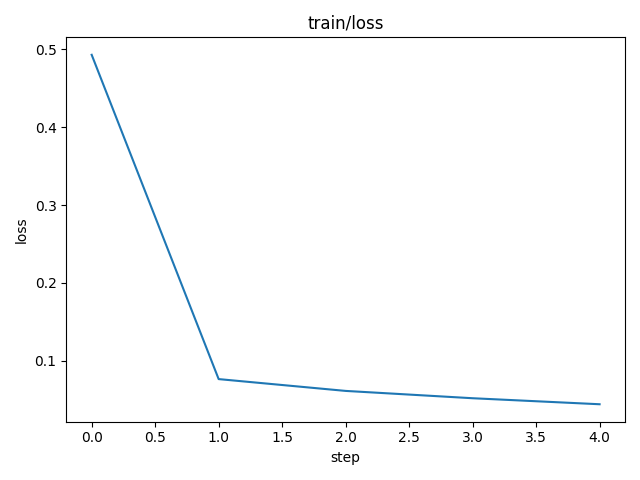

# DVC Report

params.yaml

| model       |   batch_size |   batch_per_epoch | frozen   |   frozen_idx | transforms                                                      |
|-------------|--------------|-------------------|----------|--------------|-----------------------------------------------------------------|
| DynamicUnet |            8 |                 8 | False    |            0 | [Pipeline: PILBase.create, Pipeline: partial -> PILBase.create] |

metrics.json

| train                         | eval                          |   dice_multi |   step |
|-------------------------------|-------------------------------|--------------|--------|
| {'loss': 0.03461722657084465} | {'loss': 0.03743290528655052} |     0.848855 |      4 |

